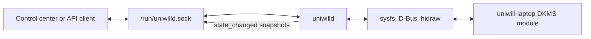

# uniwill-laptop-dkms

Linux DKMS driver, hardware-control service, and desktop integration for compatible Uniwill-based
laptops.


## Project origin and acknowledgements

`uniwill-laptop-dkms` is primarily forked from
[Wer-Wolf/uniwill-laptop](https://github.com/Wer-Wolf/uniwill-laptop) and continues development on
top of that project. It is an independent, out-of-tree secondary-development version; its driver,
service, protocol, packaging, and hardware features are maintained in this repository.

The original driver work also references and learned from:

- [pobrn/qc71_laptop](https://github.com/pobrn/qc71_laptop)
- [tuxedocomputers/tuxedo-drivers](https://github.com/tuxedocomputers/tuxedo-drivers)

Thank you to every author, maintainer, tester, and contributor of these projects. Their research,
reverse-engineering work, reviews, and testing made this continuation possible.

> This is an independently maintained, out-of-tree DKMS fork. Hardware behavior may vary by model
> and firmware, so test changes carefully.

## Overview

The repository contains a complete hardware-control stack rather than only a kernel module:

| Component | Purpose |
| --- | --- |
| `uniwill-laptop` | Kernel module for EC/WMI platform controls, hwmon, power profiles, fan control, light bar, keyboard controls, and compatible ITE 8291 RGB keyboards |
| `uniwilld` | Privileged userspace service that exposes driver and system information through a persistent JSON Unix-socket API |
| `uniwill-touchpad-sync` | User-session helper that synchronizes KDE/GNOME touchpad state with the precision-touchpad firmware |
| DKMS packaging | Rebuilds the out-of-tree kernel module whenever a supported kernel is installed |
| systemd and udev integration | Loads the module, binds supported lighting hardware, starts the service, and restores state after suspend |



## Features

### Platform and cooling

- CPU and GPU temperature, PWM, and fan-speed endpoints through hwmon.
- EC automatic control or service-managed CPU/GPU fan curves.
- Separate performance, standard, quiet, WhisperMode, and benchmark cooling behavior.
- Passive-cooling support and safe 100% fan fail-safe validation.
- Three persistent profile slots with independent plugged-in and battery branches.
- Coordinated firmware power mode, Linux power profile, CPU energy preference, fan mode, and chassis
  indicator updates.

### Lighting and keyboard controls

- EC-driven multicolor status light bar with RGB color, brightness, rainbow animation, and
  sleep-breathing control.
- ITE 8291 revision 0.03 USB HID keyboard-backlight support for `048d:6004`, `048d:6006`, and
  `048d:ce00`.
- Standard multicolor LED-class integration plus solid, breathing, wave, random, rainbow, ripple,
  marquee, raindrop, aurora, and fireworks effects.
- Fn lock, Super/Windows key control, touchpad hotkey control, and touchpad firmware-state sync.

### Device information

- Static DMI system, firmware, board, processor, and memory-module information.
- Battery details and charge-limit control.
- Physical storage and filesystem capacity information without depending on mount points.
- Native NVMe and ATA SMART data through `libblockdev-nvme` and `libblockdev-smart`; the service
  does not launch `smartctl`.

### Service protocol

- Newline-delimited JSON over `/run/uniwilld.sock`.
- Multiple concurrent clients.
- Persistent full-duplex subscriptions for ordered responses and pushed state changes.
- Complete state snapshots after successful mutations and real hardware changes.

See [`uniwilld-json-api.md`](uniwilld-json-api.md) for the complete protocol and command reference.

## Compatibility and safety

- Linux x86_64.
- Linux kernel 6.10 or newer, with matching kernel headers for DKMS.
- Root privileges for module installation and the `uniwilld` service.

The automatic-loading whitelist contains only these four DMI matches:

| System | DMI vendor | DMI board/product |
| --- | --- | --- |
| XMG FUSION 15 | `SchenkerTechnologiesGmbH` | Board `LAPQC71A` |
| XMG FUSION 15 | `SchenkerTechnologiesGmbH` | Board `LAPQC71B` |
| Intel NUC X15 | `Intel(R) Client Systems` | Product `LAPKC71E` |
| Intel NUC X15 | `Intel(R) Client Systems` | Product `LAPKC71F` |

Some hardware knowledge is based on reverse engineering. Unsupported endpoints are left unavailable;
they are not emulated. Keep firmware safeguards enabled and preserve the validated maximum-fan
points when testing custom curves.

## Install a release package

Release packages install the DKMS source, service binaries, systemd units, module-load
configuration, udev integration, desktop-session helper, documentation, and runtime dependencies.
Install the kernel headers that match the active kernel before installing the package.

### Debian and compatible Ubuntu releases

```sh
sudo apt install ./uniwill-laptop-dkms_<version>_amd64.deb
```

The DEB release is built on Debian 13 and requires the libblockdev SMART plugin. Ubuntu releases
without `libblockdev-smart3` need that library backported before installing this package.

### Fedora and RPM-based distributions

```sh
sudo dnf install ./uniwill-laptop-dkms-<version>.x86_64.rpm
```

### Arch Linux

```sh
sudo pacman -U ./uniwill-laptop-dkms-<version>-x86_64.pkg.tar.zst
```

The package attempts a DKMS build, enables `uniwilld.service` and
`uniwilld-sleep.service`, reloads udev rules, and starts the service. If the matching kernel headers
are not installed yet, install them and run:

```sh
sudo dkms autoinstall
sudo modprobe uniwill-laptop
sudo systemctl restart uniwilld.service
```

## Build from source

Install a C compiler, `make`, `pkg-config`, matching kernel headers, DKMS, systemd development files,
GLib/GIO development files, and the core/FS/NVMe/SMART development packages from libblockdev.

Build the kernel module:

```sh
make
```

Build the service and desktop helper:

```sh
make service
```

Run the userspace test suite:

```sh
make test
```

### Build native packages

Debian/Ubuntu:

```sh
./scripts/build-deb-package.sh
```

Fedora/RPM:

```sh
./scripts/build-rpm-package.sh
```

Arch Linux:

```sh
./scripts/build-arch-package.sh
```

Generated packages are written to `dist/deb/`, `dist/rpm/`, and `dist/arch/`.

## Manual DKMS installation

Register, build, and install the module for the current system:

```sh
version="$(cat VERSION)"
sudo dkms add "$PWD"
sudo dkms build -m uniwill-laptop -v "$version"
sudo dkms install -m uniwill-laptop -v "$version"
```

To reinstall the same development version:

```sh
version="$(cat VERSION)"
sudo dkms remove -m uniwill-laptop -v "$version" --all
sudo dkms add "$PWD"
sudo dkms build -m uniwill-laptop -v "$version"
sudo dkms install -m uniwill-laptop -v "$version"
```

## Service installation

The repository installation helper builds and installs the userspace components:

```sh
sudo ./install.sh
```

Uninstall them with:

```sh
sudo ./uninstall.sh
```

The DKMS step is opt-in when using the source installation helper:

```sh
sudo INSTALL_DKMS=1 ./install.sh
sudo REMOVE_DKMS=1 ./uninstall.sh
```

To install files without enabling or starting the service:

```sh
sudo ENABLE_SERVICE=0 START_SERVICE=0 ./install.sh
```

The installed systemd service uses:

```text
/usr/bin/uniwilld --socket-mode 0666 --fan-control
```

For a stricter local policy, configure a group-restricted socket:

```ini
ExecStart=/usr/bin/uniwilld --socket-mode 0660 --socket-group uniwill --fan-control
```

`uniwilld-sleep.service` stops the main service before suspend or hibernation so fan control returns
to the EC, then restarts it after resume. The new daemon instance rediscovers sysfs and restores the
persisted source-specific profile.

## API examples

Install `socat` for command-line testing:

```sh
printf '{"cmd":"status"}\n' |
  socat - UNIX-CONNECT:/run/uniwilld.sock

printf '{"cmd":"set_power_mode","mode":"performance"}\n' |
  socat - UNIX-CONNECT:/run/uniwilld.sock

printf '{"cmd":"set_fan_mode","mode":"standard"}\n' |
  socat - UNIX-CONNECT:/run/uniwilld.sock

printf '{"cmd":"set_lightbar","brightness":160,"red":255,"green":80,"blue":0}\n' |
  socat - UNIX-CONNECT:/run/uniwilld.sock

printf '{"cmd":"get_keyboard_backlight"}\n' |
  socat - UNIX-CONNECT:/run/uniwilld.sock
```

Persistent clients begin with:

```json
{"cmd":"subscribe"}
```

The daemon acknowledges the subscription and subsequently pushes revisioned `state_changed`
snapshots on the same connection. Commands and responses remain ordered while events may arrive
between responses.

## Touchpad session synchronization

`uniwill-touchpad-sync` reads the normal desktop-session state instead of granting the user direct
access to `/dev/hidraw*`. It supports KDE/KWin, GNOME/Mutter, and the kernel inhibited state.

After a source installation, log out and back in or start it once:

```sh
uniwill-touchpad-sync &
```

Read-only diagnostics:

```sh
uniwill-touchpad-sync --probe
uniwill-touchpad-sync --status
```

## Versioning and releases

`VERSION` is the single source for the SemVer release (`MAJOR.MINOR.PATCH`). `BUILD_NUMBER` is the
native-package revision for that source version and resets to `1` when `VERSION` changes. Driver or
service changes increment `VERSION`; packaging-only rebuilds increment `BUILD_NUMBER`.
`uniwilld --version` prints the combined form, for example `0.1.1+1`; native packages use their
conventional `0.1.1-1` version/release form. The DKMS package and kernel `MODULE_VERSION` use
`0.1.1`, because package-only rebuilds do not change the driver ABI or source.

Pushing a matching `vMAJOR.MINOR.PATCH` Git tag starts the GitHub Actions release workflow. The
workflow rejects a tag that differs from `VERSION`, builds x86_64 DEB, RPM, and Arch Linux packages
in native distribution environments, uploads them to the matching GitHub Release, uses the Tag
annotation as the release introduction, and appends commit hashes and subjects since the previous
Tag.

## License

This project is distributed under the
[GNU General Public License v2.0 or later](LICENSE).
